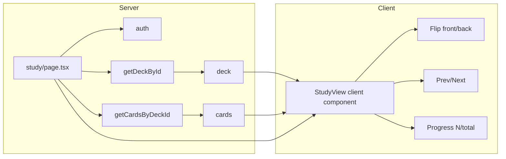

# Study page and flashcard functionality

## Scope

- **Route**: `src/app/decks/[deckId]/study/page.tsx`
- **Data**: Reuse existing `getDeckById` (`src/db/queries/decks.ts`) and `getCardsByDeckId` (`src/db/queries/cards.ts`) (ownership already enforced). No new DB queries or server actions.
- **UI**: Delegate the study view (flashcard layout, flip, progress, controls, empty state) to the **ui-page-designer** subagent with reference images from `.cursor/skills/frontend-design/references/` (e.g. `landingPage.png` for visual direction only).
- **Entry point**: Add a "Çalış" (Study) button/link on the deck detail page that navigates to `/decks/[deckId]/study`.

## Architecture

## Implementation steps

### 1. Server page and shell (main codebase)

- Create **`src/app/decks/[deckId]/study/page.tsx`**:
  - Same pattern as `decks/[deckId]/page.tsx`: `auth()`, redirect if no `userId`, resolve `deckId` from params, `getDeckById(deckId, userId)` and `getCardsByDeckId(deckId, userId)`.
  - If deck not found → `notFound()`.
  - Render same layout shell as deck detail: `FloatingBackground`, back link (to `/decks/[deckId]`), and a client component that receives `deck` (id, title) and `cards` (id, front, back) as props.

### 2. Delegate study UI to ui-page-designer subagent

- Invoke **ui-page-designer** with a clear task:
  - **Task**: Design and implement the study view for a flashcard deck. The component will receive `deck: { id, title }` and `cards: Array<{ id, front, back }>` as props. It must:
    - Show one card at a time with **front/back flip** (click or button to reveal back).
    - **Progress**: e.g. "3 / 10" or a step indicator.
    - **Navigation**: Previous / Next (and optionally wrap or disable at ends).
    - **Empty state**: When `cards.length === 0`, show a message and a link/button back to the deck (e.g. "Henüz kart yok" and link to `/decks/[deckId]`).
  - **Constraints**: Use shadcn/ui and Tailwind only; no data fetching or server actions; client component only; Turkish labels to match the app.
  - **References**: Point the subagent to `.cursor/skills/frontend-design/references/` (e.g. `landingPage.png`) for visual inspiration; do not copy pixel-perfect.
- The subagent will produce a **StudyView** (or similarly named) client component under `src/app/decks/[deckId]/study/` (e.g. `StudyViewClient.tsx`).

### 3. Integrate designed component

- In **`study/page.tsx`**, pass `deck={{ id: deck.id, title: deck.title }}` and `cards={cards.map(c => ({ id: c.id, front: c.front, back: c.back }))}`.
- Ensure the study page uses the same overall layout (max-width, padding, back link) as the deck detail page for consistency.

### 4. Add Study entry on deck detail

- In **`DeckDetailClient.tsx`**, add a **"Çalış"** (Study) button or link that navigates to **`/decks/[deckId]/study`**. Prefer placing it next to the "Kart ekle" area (e.g. in the header row).

### 5. Optional: protect /decks in middleware

- Optionally extend middleware to redirect unauthenticated users from `/decks/` to `/` for consistency with the clerk-auth rule; otherwise leave as-is since page-level checks already enforce ownership.

## File summary

| Action               | File                                                                                                       |
| -------------------- | ---------------------------------------------------------------------------------------------------------- |
| Create               | `src/app/decks/[deckId]/study/page.tsx` (server: auth, load deck + cards, layout, render client component) |
| Create (by subagent) | `src/app/decks/[deckId]/study/StudyViewClient.tsx` (flashcard UI)                                          |
| Edit                 | `src/app/decks/[deckId]/DeckDetailClient.tsx` – add "Çalış" link/button to `/decks/[deckId]/study`         |
| Optional             | `src/middleware.ts` – optionally protect `/decks` for unauthenticated users                                |

## Data and rules compliance

- **Server data / Zod**: No new server actions or form inputs; study page is read-only. Data comes from existing query helpers only.
- **Clerk / isolation**: Same as deck detail: `userId` from `auth()`, `getDeckById` and `getCardsByDeckId` scope by `clerkUserId`.
- **shadcn**: All new UI uses shadcn components per project rules and the frontend-design skill.

## Delegation note

The **ui-page-designer** subagent implements only the study **view** (layout, flip behavior, progress, navigation, empty state). The main implementation provides the route, data loading, and integration so that the designed component receives `deck` and `cards` as props and does not perform any data fetching or mutations.
